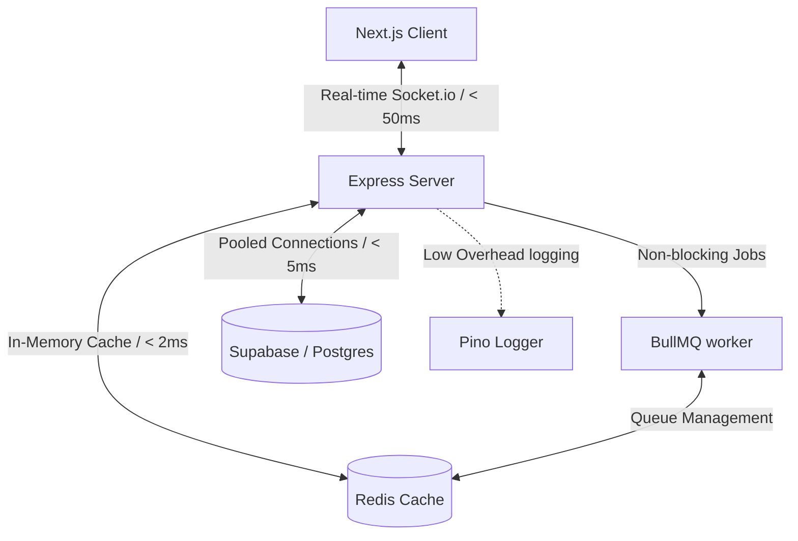

# 🚚 TransitOps

> **Enterprise-grade, ultra-low latency Fleet & Dispatch Management System.**  
> Built with a high-performance, event-driven architecture to coordinate fleet registries, dispatch operations, and maintenance/finance operations in real-time.

---

## ⚡ Latency & Performance Optimization Stack

TransitOps is engineered from the ground up to minimize network roundtrips, optimize server response times, and offload CPU-intensive operations. Below is our low-latency stack blueprint:



### 🏎️ Key Latency-Reduction Technologies & Strategies

| Strategy / Tech | Implementation Details | Latency Impact |
| :--- | :--- | :--- |
| **In-Memory Caching (Redis)** | Utilizes a Redis client helper `getOrSetCache(key, ttl, fn)` to bypass Postgres queries for frequently read, slow-moving configuration and registry data. | Bypasses database network round-trip, lowering queries from **30-100ms** to **< 1-2ms**. |
| **Asynchronous Job Queues (BullMQ)** | Offloads CPU-intensive operations (like license expiry calculations, notification schedules, and external report generation) to a background thread group. | Prevents the main Node.js event loop from blocking, keeping HTTP API response times stable under **15ms**. |
| **Real-Time Push (Socket.io)** | Replaces wasteful HTTP polling with persistent WebSocket connections for telemetry, live dispatch state changes, and board status updates. | Reduces client-side sync delay to near-zero network latency without hammering the server. |
| **High-Performance Logging (Pino)** | Non-blocking, structured JSON logging with minimal CPU overhead. | Eliminates standard `console.log` system-call blocking bottlenecks. |
| **Payload Compression** | Gzip/Deflate compression applied via Express `compression` middleware for all text/JSON response bodies. | Reduces bandwidth consumption and decreases page loading time for bandwidth-constrained users. |
| **Database Connection Pooling** | Utilizes `pg.Pool` for instant access to reusable active database connections. | Saves the **40-80ms** handshake cost associated with establishing a new DB connection on every request. |
| **Selective Queries** | Strictest application rules forbidding `SELECT *` on non-owned modules, utilizing strict column picking (`EligibleVehicle`, `EligibleDriver`). | Reduces PostgreSQL memory allocation, payload serialization, and database-to-server data transit times. |

---

## 🛠️ The Tech Stack

### Backend
* **Runtime:** Node.js (TypeScript)
* **Framework:** Express.js (v5.2.1)
* **Database:** PostgreSQL (via Supabase) with Row Level Security (RLS) & DB-level Triggers
* **Caching & Queue:** Redis + BullMQ
* **Real-time:** Socket.io (WebSocket framework)
* **Validation:** Zod
* **Logger:** Pino

### Frontend
* **Framework:** Next.js (v16.2.10) with App Router
* **Styling:** Tailwind CSS + Radix UI / shadcn/ui
* **Data Fetching:** Axios (with interceptors for Supabase JWT authorization)
* **State & Tables:** TanStack Table (v8) + React Hook Form
* **Charts:** Recharts
* **Animations:** Framer Motion

---

## 📁 Repository Structure

```
transitops/
├── MASTER.md                     # Master project rules, schema & build instructions
├── README.md                     # Project documentation & technology overview
├── backend/
│   ├── src/
│   │   ├── server.ts             # Entry point (Starts HTTP + Socket.io Server)
│   │   ├── app.ts                # Express app setup with global compression/auth middleware
│   │   ├── shared/               # Shared logic: db pool, redis cache client, pino logger
│   │   └── modules/              # Feature modules: fleet-identity, trip-ops, maintenance-finance
├── frontend/
│   ├── src/
│   │   ├── app/                  # Next.js App Router structure
│   │   ├── shared/               # Custom UI, hooks, and apiClient configurations
│   │   └── modules/              # Module-specific dashboard panels & form states
└── docs/                         # Specifications & UI mockups
```

---

## 🧩 Architectural Modules

TransitOps separates concerns strictly between three functional modules:

1. **👤 Fleet Identity & Registry (Module A)**
   * Manages profile states, vehicle rosters (`vehicles` table), and driver records (`drivers` table).
   * Enforces role-based permissions (`fleet_manager`, `safety_officer`).
2. **🚦 Trip & Dispatch Operations (Module B)**
   * Oversees trip states (`trips` table) from `Draft` ➔ `Dispatched` ➔ `Completed` / `Cancelled`.
   * Houses Socket.io-driven live boards for instant dispatch sync.
   * Auto-updates vehicle and driver availability statuses via database triggers.
3. **⚙️ Maintenance, Fuel, & Analytics (Module C)**
   * Tracks vehicle maintenance statuses, fuel logs, and trip expenses.
   * Synchronizes vehicles to `In Shop` status during active maintenance.
   * Aggregates financial reports and ROI charts utilizing database RPC functions.

---

## 🚀 Quick Start Guide

### Prerequisites
* **Node.js** (v20+ recommended)
* **Redis Instance** (localhost:6379 or cloud URI)
* **PostgreSQL / Supabase Project**

### 1. Setup Backend
```bash
cd backend
npm install
# Create a .env file containing your DB connection and Redis details
# e.g., DATABASE_URL, REDIS_URL, SUPABASE_URL, SUPABASE_SERVICE_ROLE_KEY
npm run dev
```

### 2. Setup Frontend
```bash
cd ../frontend
npm install
# Create a .env.local file with NEXT_PUBLIC_API_URL and NEXT_PUBLIC_SUPABASE_URL
npm run dev
```

Open [http://localhost:3000](http://localhost:3000) to view the client dashboard.
